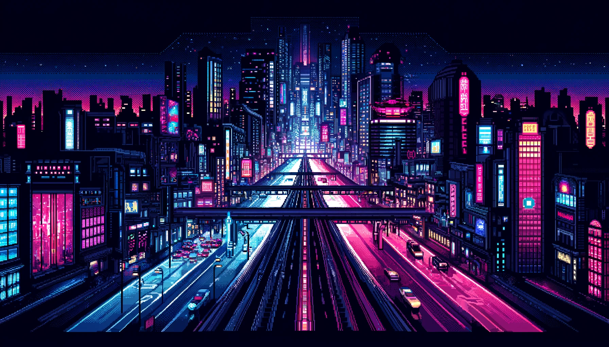

# 👋 Hi, my name is Vadym

  

<h3 style="min-width: 110px;">😀 About Me</h3>

I've been doing programming for 2 years now. I like to learn and work on something new, but I am also good at doing routine work that I enjoy. I objectively evaluate my knowledge and skills while showing all my skills and projects I have worked on. I started programming with frontend while learning the backend part mainly based on Node.js. I am ready to conquer programming with a team that supports me. I aim to develop commercial projects that people will use for their own purposes. Any evaluation of my projects is important to me.
I have been doing web development for 2 years now. I take initiative in challenging and new to me projects, but I am also good at doing routine work that I understand. I am ready to learn and develop new skills and work for the benefit of the team. I know a lot of technologies, I develop projects on MEVN, MERN stack. I am eager to work and lead my team forward. 💖

<h3 style="margin-bottom: 50px; text-align: center;">📩 Contacts</h3>

<h3 style="text-align: center; margin-bottom: 50px;">🛠️ Technologies</h3>

   

<h3 style="text-align: center; margin-bottom: 50px;">📈 My statistics</h3>

