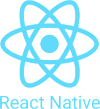

# 👋 Hi, my name is Vadym

<h3 style="min-width: 110px;">😀 About Me</h3>

Hi, my main occupation is web development with artificial intelligence features. Recently I have managed to get 1 year of commercial experience. I create minimalistic and stylish web applications, especially successful ones I try to bring to startup level and monetise. In addition, I continue to learn and improve my skills in AI development in Python. I strive to grow in a team of professionals and participate in projects of various scales at the level of intern or junior specialist. 💖

<h3 style="margin-bottom: 50px; text-align: center;">📩 Contacts</h3>

<h3 style="text-align: center; margin-bottom: 50px;">🛠️ Technologies</h3>

   

<!--  -->

<!--  -->

<!--  -->

<!--  -->
<!--  -->

<h3 style="text-align: center; margin-bottom: 50px;">📈 My statistics</h3>

